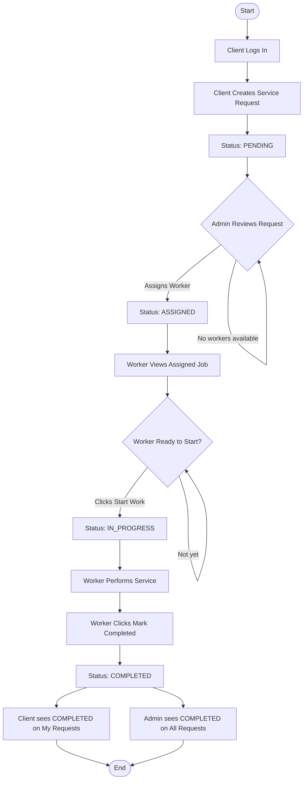

# Activity Diagram — Full FixMate Workflow

## Explanation
Shows the complete end-to-end lifecycle of a service request from client login through job completion, including all status transitions and decision points.

## Mermaid

