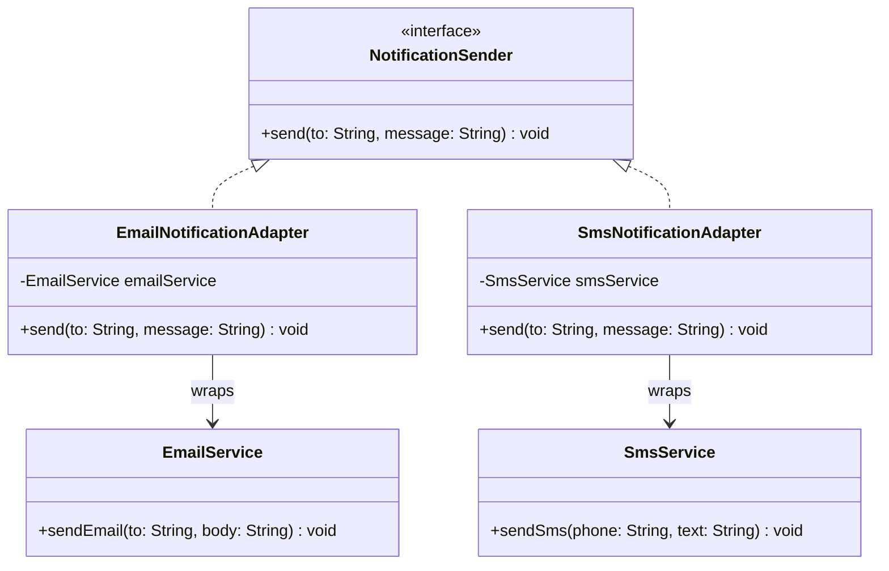

# Adapter Pattern Diagram

## Explanation
NotificationSender is the target interface the system uses. EmailService and SmsService are incompatible third-party classes with different method signatures. EmailNotificationAdapter and SmsNotificationAdapter wrap them to implement NotificationSender, letting the system send notifications through any channel without changing the calling code.

## Mermaid

