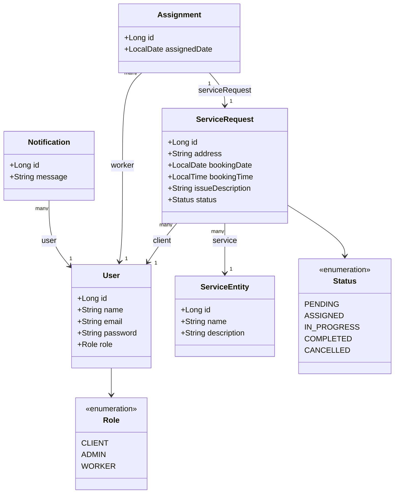

# Class Diagram

## Explanation
Shows all domain entities, their fields, and relationships. ServiceRequest is the central entity linking User (as client), ServiceEntity, and Assignment.

## Mermaid

