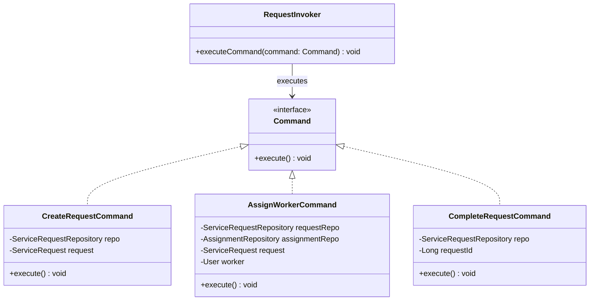

# Command Pattern Diagram

## Explanation
RequestInvoker executes any Command through a common interface. Concrete commands (CreateRequestCommand, AssignWorkerCommand, CompleteRequestCommand) encapsulate individual actions, keeping business logic self-contained and making actions easy to extend or undo.

## Mermaid

