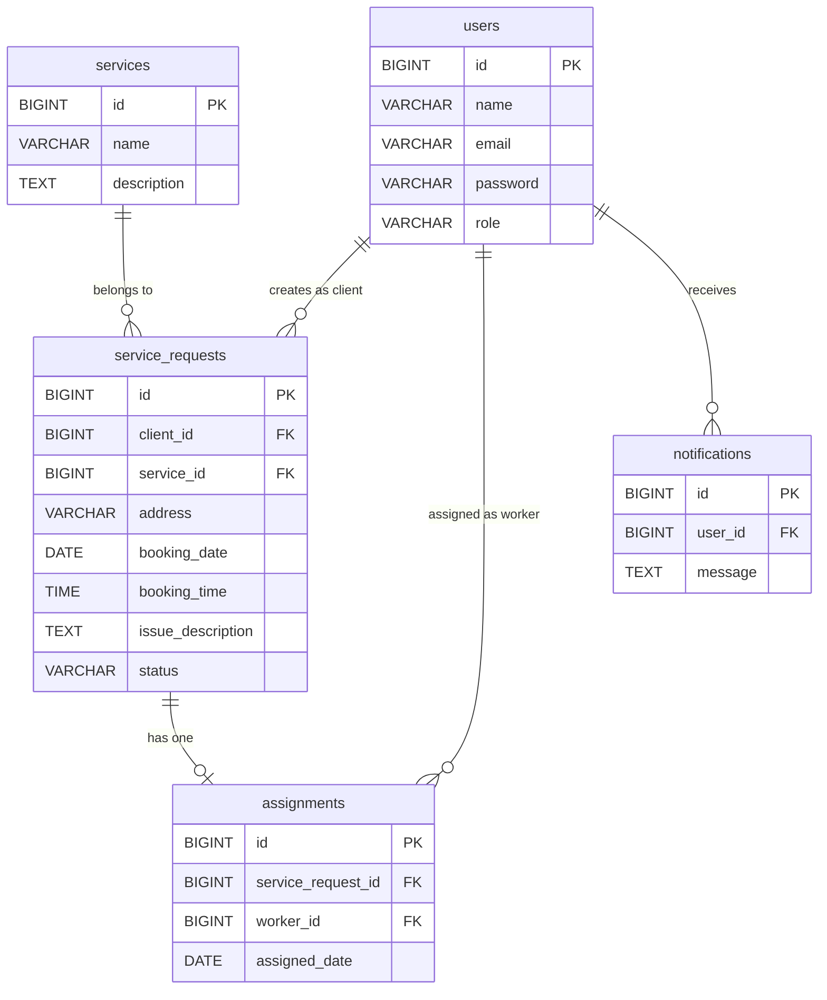

# Entity Relationship Diagram (ERD)

## Explanation
Shows all database tables, their primary keys, field types, and foreign key relationships. service_requests is the central table linked to users (as client) and services. assignments links service_requests to users (as worker).

## Mermaid

