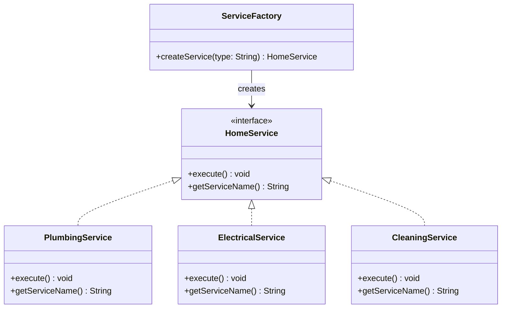

# Factory Pattern Diagram

## Explanation
ServiceFactory creates concrete service objects based on a type string. All concrete services implement the HomeService interface. This decouples the creation logic from the caller, allowing new service types to be added without changing existing code.

## Mermaid

