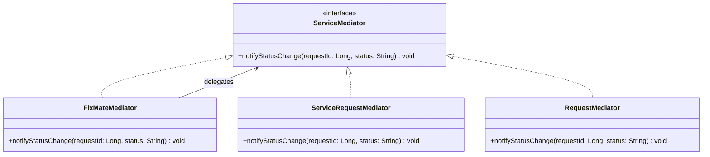

# Mediator Pattern Diagram

## Explanation
FixMateMediator decouples components by routing status-change notifications centrally. Instead of services calling each other directly, they all go through the mediator, reducing tight coupling across the system.

## Mermaid

