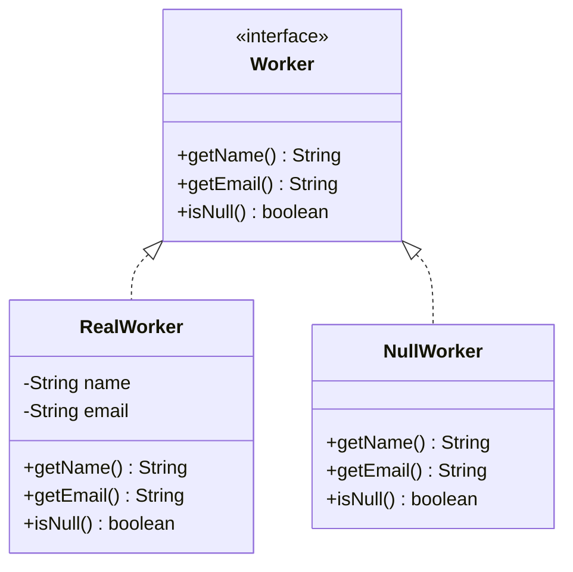

# Null Object Pattern Diagram

## Explanation
NullWorker is a safe stand-in when no worker is associated with an assignment, preventing null pointer exceptions. Both RealWorker and NullWorker implement the Worker interface so callers need no null checks — isNull() distinguishes them when needed.

## Mermaid

