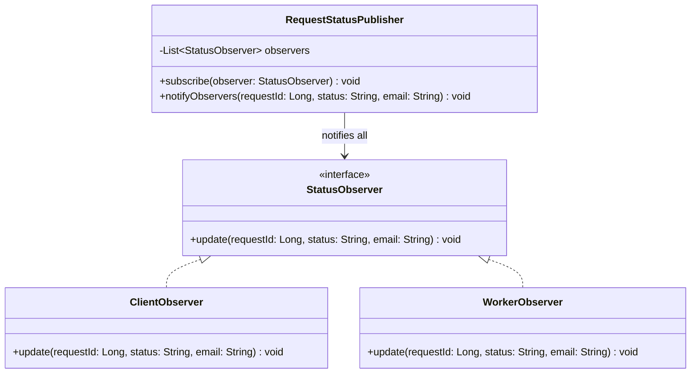

# Observer Pattern Diagram

## Explanation
RequestStatusPublisher holds a list of StatusObserver subscribers. When a request status changes, it calls update() on all registered observers. ClientObserver notifies the client, WorkerObserver notifies the assigned worker — without the publisher knowing the details of either.

## Mermaid

