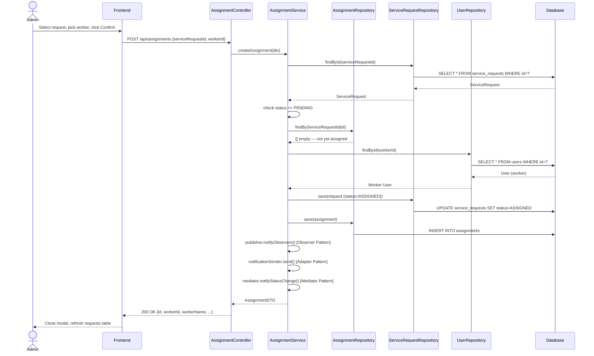

# Sequence Diagram — Admin Assigns a Worker

## Explanation
Shows the admin assigning a worker to a pending request — including validation guards (status check, duplicate check), the Command pattern executing the assignment, and Observer/Adapter/Mediator notifications being fired.

## Mermaid

