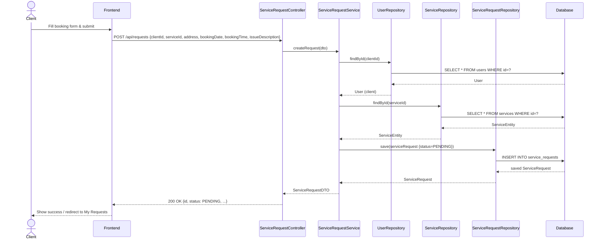

# Sequence Diagram — Client Books a Service

## Explanation
Shows the full flow when a client submits a booking — from the frontend form through the controller, service, repository, and database, returning a ServiceRequestDTO with PENDING status.

## Mermaid

