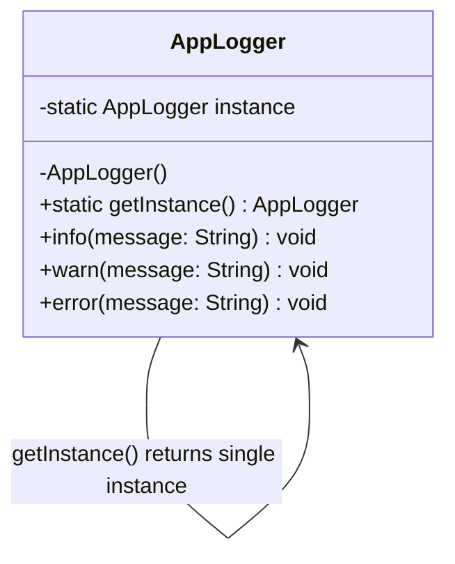

# Singleton Pattern Diagram

## Explanation
AppLogger uses the Singleton pattern — only one instance exists across the entire application. All services access the same logger via getInstance(), ensuring consistent logging without creating multiple objects.

## Mermaid

