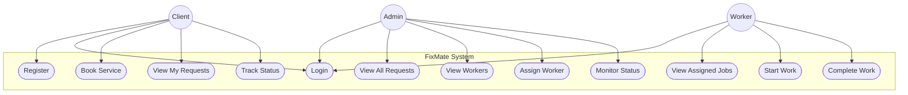

# Use Case Diagram

## Explanation
Shows what each actor (Client, Admin, Worker) can do in the FixMate system. Client focuses on booking and tracking, Admin on management and assignment, Worker on job execution.

## Mermaid

